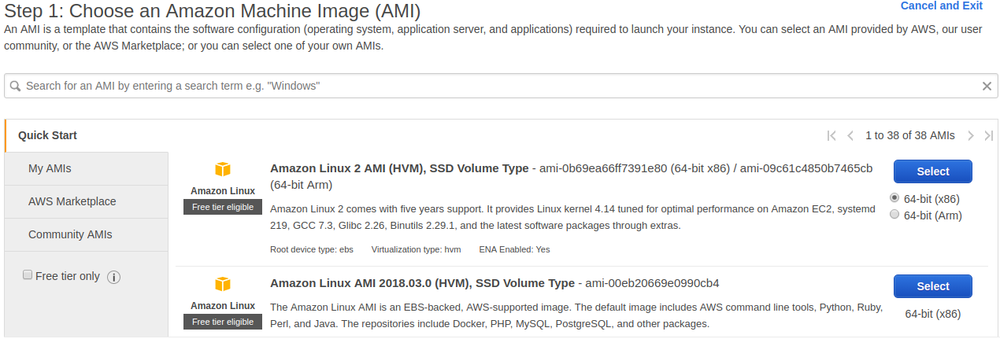
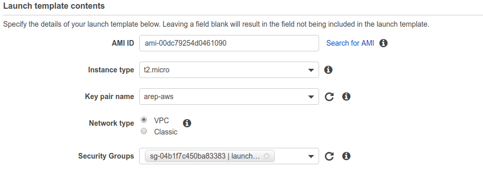

# Availability and performance

## Description

 This project is an introductory exercise to applications with high
 availability and performance
 
### Prerequisites

 You need to have installed Java at least 1.8 and Apache Maven.

 Installing Java JDK:
```
sudo apt update
sudo apt install openjdk-8-jdk
```

### Installing
 Download the repository.
```
https://github.com/SergioRt1/Availability-and-performance.git
```
 
### How to use

  To use the Console App you need to put a file with a list of real numbers inside the project folder

  finally enter the relative path to the file from the root directory via standard input, then you will get the mean and standard deviation of the numbers
  inside the provided file via standard output.
  
  
#### API 
  
  You can run it local, the valid urls are:
  ```
  /api/prime/{number} (GET)
  /api/prime/{number} (PUT)
  ```
  An example of a shell cURL
   ```
   curl -X GET \
     http://ec2-34-203-236-106.compute-1.amazonaws.com:8080/api/prime/19498 \
     -H 'cache-control: no-cache'
   ```

### Built with

 * [Java](https://www.java.com) - programming language
 * [Git](https://git-scm.com) - distributed version-control system for tracking changes in source code
 * [Gradle](https://maven.apache.org) - project management and build automation tool
 * [Spring](http://sparkjava.com) - Micro framework for creating web applications

## Tutorial

  Un laboratorio de investigación de la teoría de números lo contacto a usted y su equipo para ayudar con el análisis de números primos muy grandes, 
  se solicitó desarrollar una herramienta que permita a los investigadores de forma rápida determinar si un número no es primo o no. 
  Al tratarse de números tan grandes (10^100) no hay una forma viable de determinar si los números son primos o no, 
  por lo que se usted y su equipo propusieron una estrategia, usando el algoritmo de la criba de Eratóstenes y un estudio probabilístico se determinó que 
  en muchos casos es posible determinar si el número no es primo probando si es múltiplo de un conjunto considerable de primos, se sabe que la distribución de  
  los números primos tiende a seguir la ecuación `n/ln(n)` por lo que se puede acotar considerablemente el espacio de búsqueda y descartar a la gran mayoría de numero candidatos a ser primos y  
  los parezcan ser lo tienen una alta probabilidad de serlo, esto depende del tamaño del conjunto de primos con el que se realice la prueba, pero al ser este conjunto grande el poder de computo necesario para 
  esta validación y teniendo en cuenta lo pesadas que pueden ser las operaciones cuando se trata de números de 100 dígitos o más se requiere una infraestructura flexible capaz de acoplarse a la carga que  
  le impongan los investigadores.
  
  Para presentar la solución propuesta y resolver el problema de dispobilidad y rendimiento se elaboró el siguiente tutorial donde se explica paso a paso como es la ejecución de la solución.
  
#### 1 Preparar el proyecto

  Vamos a usar Spring como framework para nuestra aplicación, empezaremos por crear un proyecto de Java-Spring,
  eso lo podemos hacer desde la siguiente pagina web [Start Spring](https://start.spring.io) como se muestra a continuacion
  
  
  
  Crearemos un controlador que reciba las peticiones y nos permita calcular el conjunto de primos con la criba de Eratóstenes
  
  
  
  y un servicio que se encargue de la logica detras de estas operaciones:
  
  
  
  `calculateSieve` usa el algomritmo de la criba de Eratóstenes para precalcular los primos menores al numero provisto, 
  tambien tiene algunas optimizaciones y un llamado explicito al Garbage Collector para evitar sufir de problemas de memoria debido a 
  el tamaño del conjunto de primos
  
  `isPrime` es una funcion que retorna un String que ayudará a los investigadores a determinar si el numero provisto es primo o no,
  diciendo con certeza que no lo es y entregando el correspondiente factor por el que es multiplo, o diciendo que puede serlo con altas posibilidades.
  
#### 2 Exportar y subir a AWS

  ###### 4 Creación de una instancia EC2 en AWS 
   
  Ahora crearemos una instancia de EC2 en AWS, para esto accederemos a la consola AWS y buscaremos **EC2**, seleccionaremos _Launch Instance_ 
   
    
    
  Seleccionaremos una imagen de la máquina que deseamos crear, seleccionaremos la primera. 
    
   
      
  Luego seleccionamos el tipo de maquina en términos de capacidad queremos crear. 
      
   
      
  Saltaremos con la configuración por defecto hasta el paso final (se debe abrir el puerto 8080).
      
  Procederemos a crear la máquina, daremos en el boton _Launch_ 
    
   
      
  Nos pedirá crear o usar un juego de llave privada-publica para usar como mecanismo de seguridad al conectarse a la maquina por SSH, crearemos un nuevo juego de llaves, juego lo descargaremos y nos dejará un archivo `.pem` con la llave. 
      
   
      
  Una vez generadas las llaves podemos lanzar la instancia, esto tomara unos minutos hasta que AWS configure la máquina. 
     
   
  
  #### 6 Subiendo nuestro proyecto JAVA a EC2 
   
  Primero usaremos usaremos `./gradlew build` para genera el compilado, ya que estamos trabajando con un proyecto Spring Boot, este ya cuenta con un plugin para la construcción del proyecto que se encargará de subir todas las dependencias y _resources_ pertinenetes para ejecutar el proyecto en el empaqueta Jar que genera.  
  En caso de tener conflictos con los test, los podemos eliminar por ahora con el fin de obtener el Jar, dicho Jar lo encontramos en _`/build/libs`_ 
    
    
    
  Este archivo lo subiremos a la maquina en EC2, para esto usaremos SFTP y la conexión es muy similar a la que realizamos por SSH, debemos tener en la carpeta nuestra llave `pem` para conectarnos. 
    
   
   
  Nos aseguraremos de tener java instalado en nuestra maquina EC2 si no lo podemos instalar con `sudo yum install java-1.8.0-openjdk`
      
  Por último nuevamente nos conectaremos a la maquina y ejecutaremos el Jar con el comando de java `java -jar Availability-Performance-0.0.1-SNAPSHOT.jar` esto levantará el servicio en la instacia EC2 
    
   
      
  Ya podemos acceder a la URL de la maquina EC2 desde el navegador, es importante especificar el puerto 8080 en la URL 
      
   
  
#### 3 Creando el grupo de escalamiento

 Primero necesitaremos detener la instacia de EC2 para poder cambiar configuración de arraque de la maquina, así hacemos que al iniciar la instancia levante automaticamente 
 el servidor Spring, esto lo haremos medante un comando en batch
 
  
 
 
 
 
 
 
 
 Ahora crearemos una imagen a partir de la instancia que hemos creado, esta se usará como AMI para levantar las nuevas instancias como una copia de esta.
 
 
 
 
 
 Ahora una platilla de despliegue a partir de AMI de la imagen creada recientemente
 
 
 
 
 
 
 
 
 
 Ahora creamos el grupo de escalamiento en la opcion _Auto Scaling Groups_
 
 
 
 
 
 
 
 
 
  
  
## Author

 * **[Sergio Rodríguez](https://github.com/SergioRt1)**
 
## License

This project is licensed under the Apache-2.0 License - see the [LICENSE](LICENSE) file for details